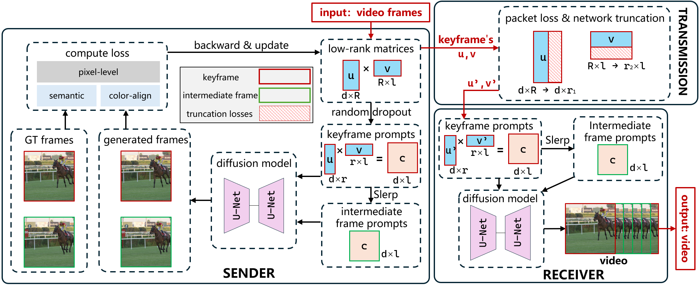
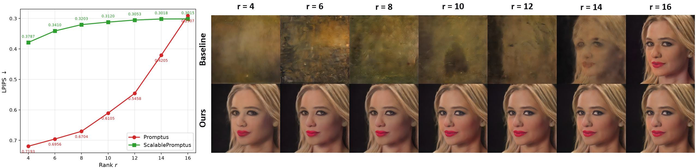

<div align="center">

# 🎬 ScalablePromptus: Scalable and High-Fidelity Prompt-Based Video Streaming

> ⚠️ **This work is currently under submission to AAAI 2027. Please cite our arxiv version if you need our code.**

</div>

---

## 🖼️ Method Overview

<p align="center">
  
</p>

## 📈 Scalable Streaming Results

<p align="center">
  
</p>

---

## 📦 Environment Setup

### Prerequisites

- **CUDA** ≥ 12.1
- **Python** 3.10
- **PyTorch** ≥ 2.0

### Install via Conda (Recommended)

```bash
# Clone the repository
git clone <repo-url> && cd Promptus

# Create conda environment
conda env create -f environment.yml
conda activate scalablepromptus

# Install additional pip dependencies
pip install open_clip_torch diffusers scikit-image lpips
```

### Download Checkpoints

Place the following pretrained model checkpoints under `checkpoints/`:

| Model       | File                                    | Source                                      |
|-------------|-----------------------------------------|---------------------------------------------|
| SD-Turbo    | `checkpoints/sd_turbo.safetensors`      | [Stability AI](https://huggingface.co/stabilityai/sd-turbo) |
| SDXL-Turbo (optional) | `checkpoints/sd_xl_turbo_1.0_fp16.safetensors` | [Stability AI](https://huggingface.co/stabilityai/sdxl-turbo) |

---

## 🚀 Training

### Prepare Data

Organize your video frames as numbered PNG images under `data/<video_name>/`:

```
data/
└── uvg/
    ├── 00000.png
    ├── 00001.png
    ├── 00002.png
    └── ...
```

### Standard Inversion

```bash
python inversion.py \
    -frame_path data/uvg \
    -max_id 140 \
    -rank 16 \
    -interval 10 \
    -clip_weight 0.5 \
    -color_weight 0.3
```

| Argument         | Description                              | Default      |
|------------------|------------------------------------------|--------------|
| `-frame_path`    | Path to video frame directory            | **Required** |
| `-max_id`        | Maximum frame ID to process              | `140`        |
| `-rank`          | LoRA rank for prompt decomposition       | `16`         |
| `-interval`      | Keyframe interval (every N frames)       | `10`         |
| `-clip_weight`   | Weight for CLIP perceptual loss          | `0.5`        |
| `-color_weight`  | Weight for color correction loss         | `0.3`        |

### Nested Dropout Inversion (Scalable)

```bash
python inversion_nested_dropout.py \
    -frame_path "data/uvg" \
    -max_id 140 \
    -rank 16 \
    -min_rank 4 \
    -interval 10 \
    --nested_dropout \
    -suffix _dropout4
```

| Argument            | Description                                 | Default      |
|---------------------|---------------------------------------------|--------------|
| `-min_rank`         | Minimum rank for nested dropout             | `4`          |
| `--nested_dropout`  | Enable nested dropout training              | (flag)       |
| `-suffix`           | Suffix appended to output directory name    | `""`         |

Results are saved to `results/rank<rank>_interval<interval><suffix>/`.

---

## 🧪 Evaluation

### Adaptive Bitrate Simulation

Evaluate reconstruction quality at different truncation ranks (scalable streaming):

```bash
# With nested dropout — test multiple truncation ranks
python simulate_adaptive.py \
    -frame_path "data/uvg" \
    -prompt_dir "/root/autodl-tmp/uvg/results/rank16_interval10_dropout4" \
    -rank 16 \
    -interval 10 \
    --trunc_ranks 4 6 8 10 12 14 16

# Without dropout — test a single rank
python simulate_adaptive.py \
    -frame_path "data/sky" \
    -prompt_dir "/root/autodl-tmp/sky/results/rank16_interval10" \
    -rank 16 \
    -interval 10 \
    --trunc_ranks 16
```

### Packet Loss Simulation

Simulate video streaming under packet loss conditions:

```bash
python simulate_packetloss.py \
    -frame_path "/root/Promptus/data/uvg" \
    -prompt_dir "/root/autodl-tmp/uvg/results/rank16_interval10_dropout4" \
    -rank 16 \
    -interval 10 \
    --min_rank 4 \
    --loss_rates 0.0 0.05 0.1 0.2 \
    --p_gb 0.1 \
    --p_bg 0.3
```

| Argument         | Description                                  | Default            |
|------------------|----------------------------------------------|--------------------|
| `--trunc_ranks`  | Truncation ranks to evaluate                 | `4 6 8 10 12 14 16`|
| `--loss_rates`   | Packet loss rates to simulate                | `0.0 0.05 0.1 0.2` |
| `--p_gb`         | Gilbert-Elliott good→bad transition prob.    | `0.1`              |
| `--p_bg`         | Gilbert-Elliott bad→good transition prob.    | `0.3`              |
| `--min_rank`     | Minimum rank used during nested dropout      | `4`                |

> 💡 **Tip**: The evaluation script saves the first generated frame (frame 0) as an image. You can modify the naming in `simulate_adaptive.py` around line 329.

---

## 📊 Metrics

Evaluation reports the following metrics for each configuration:

| Metric  | Description                          |
|---------|--------------------------------------|
| **PSNR**| Peak Signal-to-Noise Ratio           |
| **SSIM**| Structural Similarity Index Measure  |
| **LPIPS**| Learned Perceptual Image Patch Similarity |


---

## 📝 License

This project is licensed under the **Apache License 2.0**. See [LICENSE](LICENSE) for details.

## 📚 Citation

If you find this work useful, please consider citing:

```bibtex
comming soon
```
